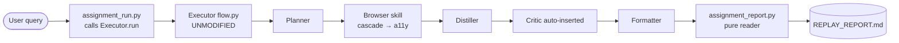
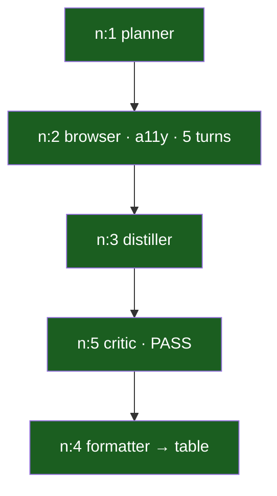

# Session 9 Assignment — Browser Comparison Agent + Replay Viewer

**Task chosen:** *Compare the top 3 trending **Python** repositories on GitHub **this week**.*

A real comparison that `web_search` + `fetch_url` cannot do: the data only
exists after you drive the page's **Language** and **Date-range** filter
dropdowns. The agent opens each dropdown, selects an option, and reads the
filtered list — landing on the **a11y** cascade layer — then distils the
result into a comparison table. The whole run is replayable.

> **Result (one clean run):** path = `a11y`, 5 browser turns, both filters
> applied (`github.com/trending/python?since=weekly`), **$0.0000** on free-tier
> Gemini 3.1 Flash-Lite. Full evidence in
> [`code/state/sessions/s9_assignment_gh_trending/REPLAY_REPORT.md`](code/state/sessions/s9_assignment_gh_trending/REPLAY_REPORT.md).

---

## 1. Why this task

The assignment forbids passive snippet scraping and demands ≥3 visible browser
actions. GitHub Trending is ideal because its filters are **real interactive
widgets**, and crucially it exercises the signature Session 9 mechanism — the
**dropdown-as-fence rule**:

| Turn | a11y legend shows | What happened |
|---|---|---|
| 1 | `[21]<summary>Language: Any</summary>` (trigger) | model clicks it **alone** (fence) |
| 2 | `[22]<input>Type or choose a language</input>`, `[23..]<a role="menuitemradio">` | popover options **appear** next turn |
| 3 | `[21]<summary>Language: Python</summary>` | Python now selected |
| 4 | `[24]<a role="menuitemradio">This week</a>` | date popover options appear |
| 5 | `[22]<summary>Date range: This week</summary>` | This week selected → done |

This is the §8.1 fence rule working live: a dropdown trigger is the only action
in its turn, and the next turn's fresh a11y snapshot reveals the options that
did not exist in the DOM before the click.

---

## 2. How it runs (no orchestrator modification)

The task goes through the **unmodified** Session 8 orchestrator. The driver
only calls the public `Executor.run(query)` entry point; the Planner decides to
emit a `browser` node because the query targets a specific site's interactive
listing (exactly the case `prompts/planner.md` tells it to prefer Browser for).



### Reproduce

```bash
# from repo root, one-time environment setup
python3.11 -m venv .venv && source .venv/bin/activate
pip install fastapi "uvicorn[standard]" httpx python-dotenv pydantic jsonschema \
            pyyaml playwright trafilatura pillow networkx numpy faiss-cpu
python -m playwright install chromium
# gateway.py expects EAGV3/llm_gatewayV9 as a sibling of code/ — satisfy it:
ln -sfn "$PWD/S9SharedCode/llm_gatewayV9" "$PWD/llm_gatewayV9"   # adjust if layout differs

# 1) start the V9 gateway (serves /v1/chat, /v1/vision, /v1/cost on :8109)
cd llm_gatewayV9 && ../.venv/bin/python main.py &        # or: bash run.sh

# 2) run the comparison agent through the orchestrator
cd ../code && ../.venv/bin/python assignment_run.py

# 3) build the 8-item replay report
../.venv/bin/python assignment_report.py s9_assignment_gh_trending
# open code/state/sessions/s9_assignment_gh_trending/REPLAY_REPORT.md in VS Code preview
```

---

## 3. The 8 required replay items → where each lives

The replay report ([`REPLAY_REPORT.md`](code/state/sessions/s9_assignment_gh_trending/REPLAY_REPORT.md))
is generated entirely by reading persisted state — it contains all eight:

| # | Item | Source the report reads |
|---|------|-------------------------|
| 1 | Original user goal | `state/sessions/<sid>/query.txt` |
| 2 | Planner DAG | `graph.json` → rendered as a Mermaid graph + node table + recovery narrative |
| 3 | Browser path chosen | `BrowserOutput.path` from the browser node (`a11y`) |
| 4 | Browser actions taken | `BrowserOutput.actions` (per-turn click/type/key) |
| 5 | Screenshots / page-state logs | per-turn PNGs + a11y legends under `state/sessions/<sid>/browser/.../a11y/` |
| 6 | Extracted data | Distiller node output (structured JSON) |
| 7 | Final comparison table | Formatter node `final_answer` |
| 8 | Turn count + cost summary | `BrowserOutput.turns` + V9 ledger `GET /v1/cost/by_agent?session=<sid>` |

---

## 4. What I added / changed — and why each is allowed

The assignment rule: *"The orchestrator must not be modified. Any new behavior
must plug in through the skill catalogue or as a Browser skill extension."*

**Orchestrator core — UNTOUCHED:** `flow.py`, `recovery.py`, `skills.py`,
`schemas.py`, `browser/skill.py`, `browser/driver.py`, `agent_config.yaml`.

| File | Change | Category (why allowed) |
|---|---|---|
| `code/assignment_run.py` | **NEW** — driver that calls the public `Executor.run(query)` | external harness, no core edit |
| `code/assignment_report.py` | **NEW** — replay/report generator; pure reader of persisted state + ledger | external tooling, no core edit |
| `code/browser/dom.py` | retry `enumerate_interactives` once on "Execution context was destroyed" (GitHub's filters are `<a>` links → full navigation) | **Browser skill extension** |
| `code/prompts/critic.md` | judge **substance not presentation**, and don't treat "no raw-source block" as proof of fabrication | **skill catalogue** (prompt) |
| `llm_gatewayV9/agent_routing.yaml` | `critic: groq → gemini` (stronger, free-tier judge that returns genuine verdicts) | **gateway routing config** |

### Why the two catalogue tweaks were necessary (and faithful to Session 9)

The auto-inserted Critic gates the **Distiller** and `flow.py` wires it
`inputs=["USER_QUERY", distiller]` — it never sees the Browser's raw evidence.
A strict/weak judge therefore (a) declared correct data "fabricated" because it
had no source to check, and (b) failed the intermediate JSON for "not being a
table." Both are the exact §12.2 lesson — *"a Critic with only the output is a
Critic guessing,"* and an evaluator must judge **what it can actually see**. I
could not change the wiring (that is in the orchestrator), so the correct lever
is the critic prompt + a capable judge. With both, the Critic returns a genuine
`pass` on complete data and a genuine `fail` when the Distiller drops the
requested descriptions — which is exactly what the recovery loop is for.

---

## 5. The run, as a graph (one clean execution)



Some runs show **1 extra recovery cycle**: if the Distiller's first attempt
omits the descriptions the user asked for, the (now genuine) Critic fails it,
the orchestrator re-plans, the Browser+Distiller re-run, and the second Critic
passes. That is the recovery machinery — including the Session 9
**recovery-amnesia fix** (the recovery Planner is handed prior completed node
ids to reuse) — working as designed. The report's §2 narrates whichever path
the captured run took.

---

## 6. Final comparison table (captured)

| Repository | Stars (this week) | Description |
|---|---|---|
| mvanhorn / last30days-skill | 43,339 | AI agent skill that researches any topic across Reddit, X, YouTube, HN, Polymarket, and the web. |
| chopratejas / headroom | 29,746 | Compress tool outputs, logs, files, and RAG chunks before they reach the LLM. |
| NVIDIA / SkillSpector | 6,886 | Security scanner for AI agent skills. |

*(Star counts drift run-to-run because the data is live — proof it is read from
the real page, not a cached snippet.)*

---

## 7. Files map

```
S9SharedCode/
├── ASSIGNMENT_S9.md                      ← this document
├── README_SESSION9.md                    ← session-notes → code map (context)
├── code/
│   ├── assignment_run.py                 ← NEW driver (public Executor.run)
│   ├── assignment_report.py              ← NEW replay/report generator
│   ├── _smoke_browser.py                 ← NEW direct-cascade de-risk test
│   ├── browser/dom.py                    ← navigation-retry guard (skill ext.)
│   ├── prompts/critic.md                 ← sharpened critic (catalogue)
│   └── state/sessions/s9_assignment_gh_trending/
│       ├── REPLAY_REPORT.md              ← the 8-item deliverable
│       ├── graph.json, query.txt, nodes/ ← persisted run
│       └── browser/browser_*/a11y/turn_*_raw.png + _legend.txt
└── llm_gatewayV9/agent_routing.yaml      ← critic: gemini (routing config)
```
```
