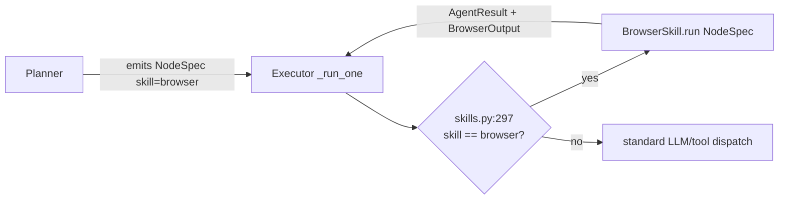
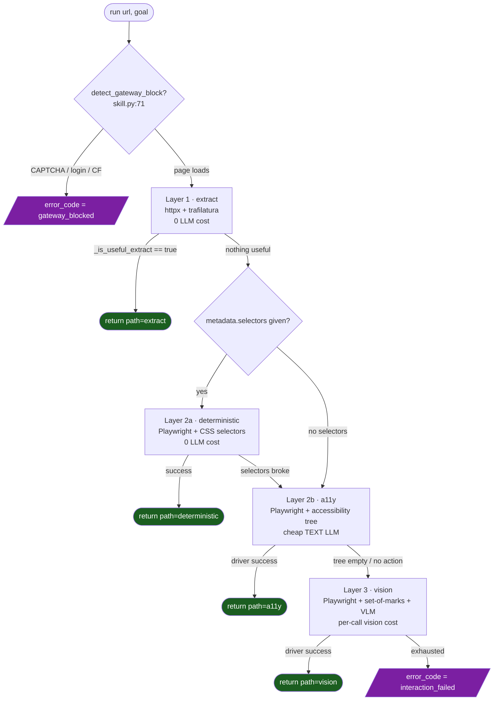
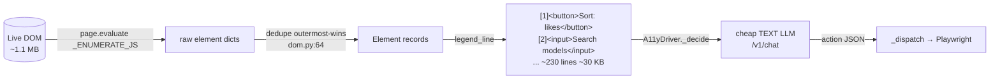
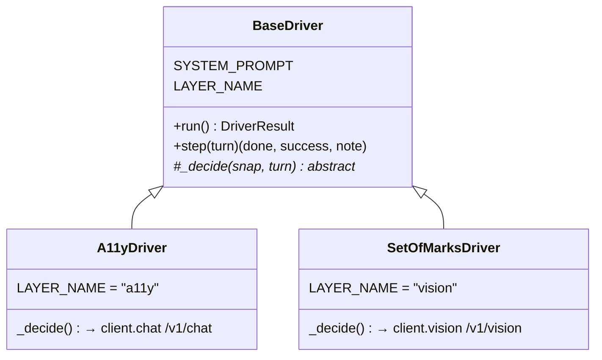
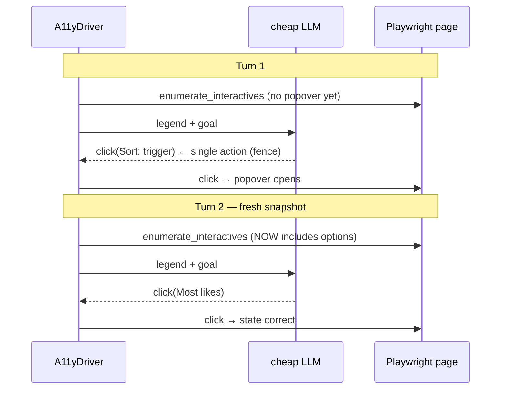
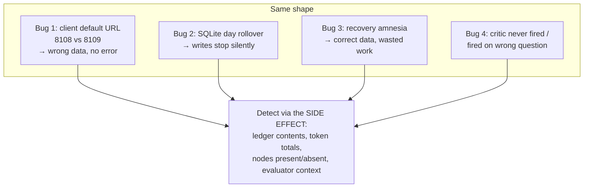
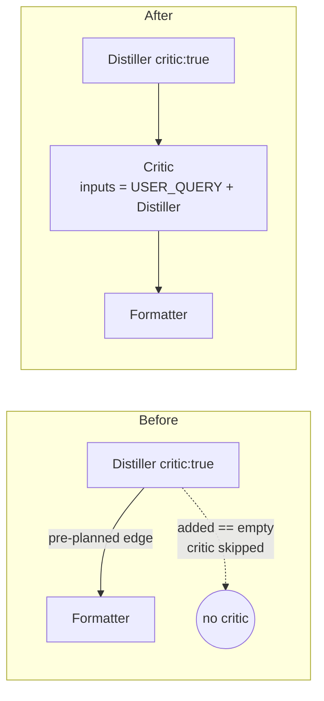
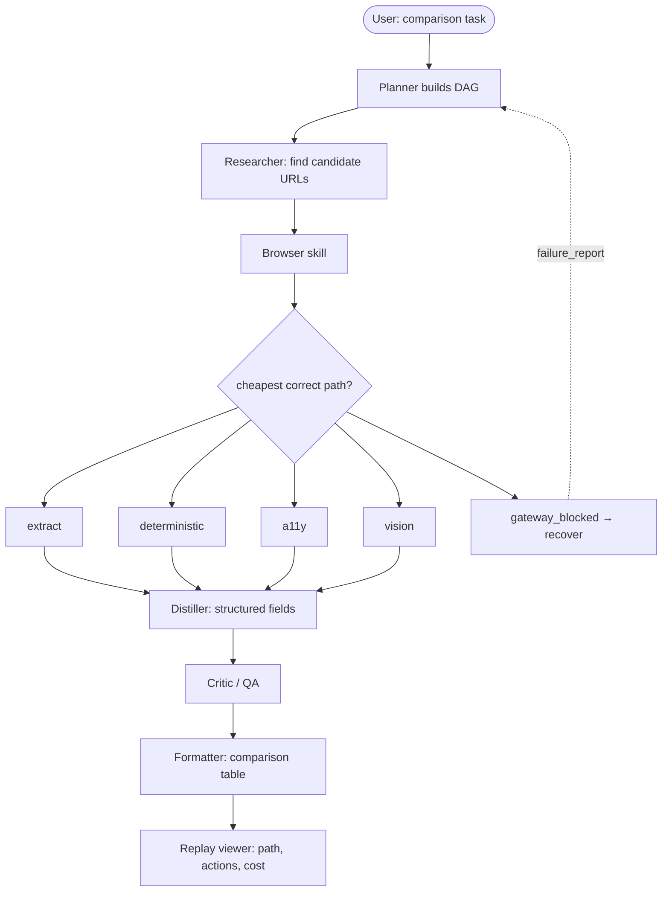
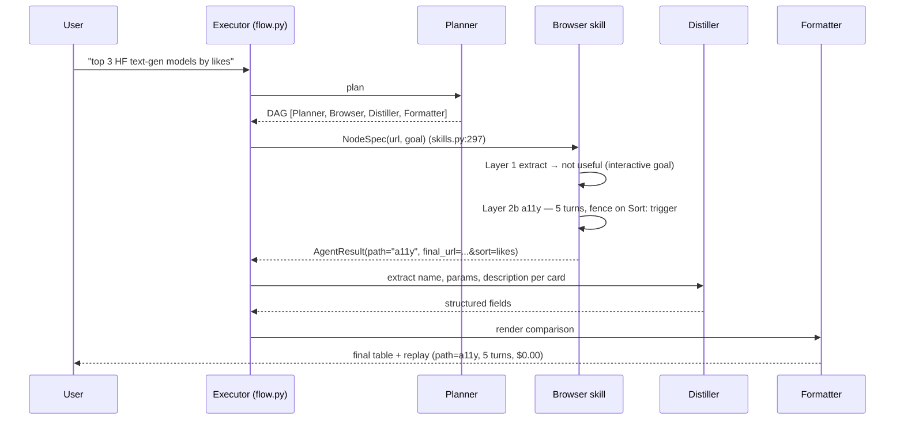

# Session 9 — Browser Agents & Autonomous Web
### A map from the session notes to the code

This document links every claim in `Axiom9.txt` to the file, class, and line that
implements it. It is meant to be read with the code open. Diagrams are written in
Mermaid and render in VS Code's Markdown preview and on GitHub.

> **One-line summary of Session 9:** add a single new **Browser** skill that browses
> the live web through a four-layer cost cascade, give the gateway a **`/v1/vision`**
> endpoint so the most expensive layer can reach a vision model, and fix four
> orchestrator bugs that all shared the same shape (the success path and the failure
> path looked identical from the caller). **The S8 orchestrator's core was not
> rewritten — the skill plugs in through config + a dispatch branch.**

---

## 1. Repository layout (what Session 9 touched)

```
S9SharedCode/
├── code/
│   ├── agent_config.yaml        ← NEW catalogue entry: browser:           (§2)
│   ├── skills.py                ← NEW dispatch branch for "browser"        (§2)
│   ├── schemas.py               ← NEW BrowserOutput, ErrorCode, error_code (§7)
│   ├── flow.py                  ← orchestrator: 2 of the 4 diagnostics     (§6)
│   ├── recovery.py              ← critic-fail policy + cap                 (§6)
│   ├── prompts/browser.md       ← NEW Browser skill prompt
│   ├── prompts/planner.md       ← recovery-amnesia teaching section        (§6)
│   ├── browser/                 ← NEW package — the whole cascade          (§3-§5)
│   │   ├── skill.py             ← cascade controller + gateway-block detect
│   │   ├── driver.py            ← BaseDriver, A11yDriver, SetOfMarksDriver
│   │   ├── dom.py               ← interactive-element enumeration + dedupe
│   │   ├── highlight.py         ← set-of-marks drawing (Pillow + DPR)
│   │   └── client.py            ← framework-free V9 gateway client
│   └── tests/
│       ├── test_recovery_amnesia.py   ← diagnostic #3
│       ├── test_critic_autoinsert.py  ← diagnostic #4
│       └── test_natural_vision_search.py
└── llm_gatewayV9/
    ├── main.py                  ← NEW POST /v1/vision endpoint             (§8)
    ├── providers.py             ← 2 gateway quirk fixes                    (§8)
    └── agent_routing.yaml       ← browser: gemini pin
```

---

## 2. How the skill plugs into the runtime (the S8 promise honoured)

The session's central architectural claim is that **a new skill is added without
editing the orchestrator**. Three small things were added, nothing was rewritten:

| What was added | Where | Purpose |
|---|---|---|
| A catalogue entry | [`agent_config.yaml:87`](code/agent_config.yaml#L87) | makes the planner aware of `browser` |
| A prompt file | [`prompts/browser.md`](code/prompts/browser.md) | describes the skill to the planner |
| A dispatch branch | [`skills.py:297`](code/skills.py#L297) | hands a `NodeSpec` to `BrowserSkill.run()` |

The dispatch branch is deliberately a *bypass*: the Browser skill does not use the
normal "render prompt → call gateway chat → parse" path because it owns its own
cascade and makes its own gateway calls internally.



**Read the branch:** [`skills.py:297-317`](code/skills.py#L297) builds a `NodeSpec`
from the graph node's `inputs`/`metadata`, constructs `BrowserSkill` with an
artifacts dir scoped to the session, and returns its `AgentResult` unchanged.

---

## 3. The four-layer cost cascade (the architecture)

> "A 2026 browser agent that costs cents per session does the cheap thing first and
> escalates only when the cheap thing fails." — Axiom9 §3

The cascade is implemented entirely inside
[`BrowserSkill.run()`](code/browser/skill.py#L147). Each layer is tried in order;
the first one that produces a useful answer returns immediately.



### Layer-by-layer code map

| Layer | Doc claim | Code | Notes |
|---|---|---|---|
| **Precondition** | "page must actually load" | [`detect_gateway_block`](code/browser/skill.py#L71), markers at [`skill.py:47`](code/browser/skill.py#L47) | checked on raw HTML **and** again on the JS-rendered page at [`skill.py:276`](code/browser/skill.py#L276) |
| **1 · extract** | httpx → trafilatura, no browser/LLM | [`skill.py:166-189`](code/browser/skill.py#L166) | `_fetch_html` + `_extract`; usefulness gate `_is_useful_extract` ([`skill.py:106`](code/browser/skill.py#L106)) needs ≥200 chars and a non-interactive goal |
| **2a · deterministic** | CSS selectors, no LLM | [`_try_deterministic`](code/browser/skill.py#L310) | **only fires if the caller supplied `metadata.selectors`** ([`skill.py:198`](code/browser/skill.py#L198)); never guesses selectors |
| **2b · a11y** | cheap text LLM reads the a11y tree | [`A11yDriver`](code/browser/driver.py#L337) via `_drive` ([`skill.py:213`](code/browser/skill.py#L213)) | text-only `/v1/chat` call |
| **3 · vision** | screenshot + set-of-marks + VLM | [`SetOfMarksDriver`](code/browser/driver.py#L302) via `_drive` ([`skill.py:227`](code/browser/skill.py#L227)) | `/v1/vision` call |

> **Why the cost claim holds:** Layers 1 and 2a make **zero** LLM calls. Layer 2b
> sends only text. Only Layer 3 sends an image. The skill never reaches a more
> expensive layer until the cheaper one provably failed.

---

## 4. The accessibility tree (Layer 2b internals)

> "A large commercial news home page is ~6 MB of HTML / 30,000 nodes. The same
> page's a11y tree is ~30 KB / a few hundred nodes — a 200× reduction." — Axiom9 §4

The code does **not** call Playwright's `page.accessibility.snapshot()` directly;
instead it enumerates interactive elements with one JavaScript pass and turns each
into a compact legend line — structurally equivalent, lower noise.

- **Enumeration:** [`enumerate_interactives`](code/browser/dom.py#L179) runs
  `_ENUMERATE_JS` ([`dom.py:33`](code/browser/dom.py#L33)) which collects links,
  buttons, inputs, ARIA-role elements, and `cursor:pointer` elements.
- **Legend line format** `[id]<tag role="role">name</tag>`:
  [`Element.legend_line`](code/browser/dom.py#L151) — the exact "browser-use" style
  the prompts reference.
- **The 200× reduction in practice:** the legend is capped at 40 000 chars
  ([`PageSnapshot.legend`](code/browser/dom.py#L171)) so even a huge page fits in a
  cheap text call.



### The dedupe pass (the "230 real interactive elements" claim)

> "After a dedupe pass that removed nested decorations counted as separate items,
> there were 230 real interactive elements." — Axiom9 §4

Implemented as **outermost-wins** in [`dom.py:64-75`](code/browser/dom.py#L64): any
candidate whose ancestor is also a candidate is dropped. The companion
`SVG_PRIMITIVE` set ([`dom.py:45`](code/browser/dom.py#L45)) prevents an SVG
`<rect>`/`<path>` inside a button from being numbered separately — this is exactly
the Excalidraw failure described in §5.

---

## 5. Set-of-marks (Layer 3 internals)

> Three details "would be easy to get wrong." — Axiom9 §5

```mermaid
flowchart TD
    SHOT[page.screenshot raw PNG<br/>device pixels] --> ANN[annotate&#40;png, elements, dpr&#41;<br/>highlight.py:91]
    SNAP[enumerate_interactives<br/>CSS-pixel rects] --> ANN
    ANN -->|"box = rect × dpr  (highlight.py:104)"| MARKED[marked PNG<br/>numbered dashed boxes]
    MARKED --> DURL[to_data_url] --> VIS[client.vision → /v1/vision]
    VIS -->|"picks mark [N]"| MAP[snap.by_id N → cx,cy] --> CLICK[page.mouse.click]
```



| Detail (doc §5) | Code | How it's handled |
|---|---|---|
| Draw boxes **after** capture with Pillow, not JS overlays | [`highlight.annotate`](code/browser/highlight.py#L91) | operates on the screenshot bytes; the live DOM is never mutated |
| Account for **device pixel ratio (DPR)** | [`highlight.py:104-106`](code/browser/highlight.py#L104) | every rect multiplied by `dpr`; `dpr` read from the page in [`dom.py:126`](code/browser/dom.py#L126) |
| **Dedupe** the clickable list | [`dom.py:64`](code/browser/dom.py#L64) | outermost-wins + SVG-primitive exclusion (the Excalidraw fix) |

The number → click translation lives in the shared dispatcher
[`_dispatch`](code/browser/driver.py#L162): `click` looks up the mark via
`snap.by_id()` and clicks the element centre (`el.cx, el.cy`).

---

## 6. The driver loop and the "dropdown-as-fence" rule

Layers 2b and 3 share one loop. The doc calls this "Layer 2b is Layer 3 minus the
screenshot" — and that is literally the class hierarchy:



- Shared loop: [`BaseDriver.run`](code/browser/driver.py#L283) /
  [`BaseDriver.step`](code/browser/driver.py#L241).
- The **only** difference is `_decide()`:
  [`SetOfMarksDriver._decide`](code/browser/driver.py#L308) attaches an annotated
  screenshot; [`A11yDriver._decide`](code/browser/driver.py#L344) sends the legend
  alone.

### The fence rule (Axiom9 §8.1)

> "Layer 2b has no eyes between turns… when an action changes the page, any later
> action in the same turn is operating on stale information."

Three mechanisms encode the fix:

1. **Max 2 actions per turn** — enforced in the schema:
   `ACTION_SCHEMA.actions.maxItems = 2` ([`driver.py:40`](code/browser/driver.py#L40)).
2. **Dropdown triggers must be alone** — taught in `SYSTEM_PROMPT_A11Y`'s CRITICAL
   RULES ([`driver.py:104-118`](code/browser/driver.py#L104)): names ending in `▾`
   or `:` or starting with `Sort:` are dropdown triggers; the click must be the only
   action that turn.
3. **Fresh snapshot every turn** — `step()` re-runs `enumerate_interactives` at the
   top of each turn ([`driver.py:242`](code/browser/driver.py#L242)), so the next
   turn sees the popover options that didn't exist before the click.



---

## 7. Typed contracts (schemas)

Session 9 adds two things to [`schemas.py`](code/schemas.py), both additive:

- **`BrowserOutput`** ([`schemas.py:142`](code/schemas.py#L142)) — the typed payload
  written into `AgentResult.output`. `path` is a `Literal["extract","deterministic","a11y","vision"]`
  so replay/planner can see which layer fired.
- **`ErrorCode`** ([`schemas.py:115`](code/schemas.py#L115)) + the new
  `AgentResult.error_code` field ([`schemas.py:139`](code/schemas.py#L139)). Five
  values: `gateway_blocked`, `extraction_failed`, `interaction_failed`, `timeout`,
  `vlm_unavailable`. Other skills leave it `None` and fall through to the text
  heuristics in `recovery.classify_failure`.

The packers that build these live at the bottom of `skill.py`:
[`_pack`](code/browser/skill.py#L351) (success, non-driver layers),
[`_pack_driver`](code/browser/skill.py#L362) (success, a11y/vision), and
[`_pack_error`](code/browser/skill.py#L376) (failure with an `error_code`).

---

## 8. Gateway V9

### `POST /v1/vision`

The new endpoint is a thin shim over `/v1/chat`
([`main.py:641-668`](llm_gatewayV9/main.py#L641)): it packs `image` + `prompt` into
one multimodal user message, lets `_required_caps` ([`main.py:274`](llm_gatewayV9/main.py#L274))
auto-detect the image and require a vision-capable provider, and optionally enforces
a JSON schema. The Browser client calls it from
[`client.vision`](code/browser/client.py#L63).

```mermaid
flowchart LR
    SOM[SetOfMarksDriver._decide] -->|data: URL + prompt + schema| CV[V9Client.vision<br/>client.py:63]
    CV -->|POST /v1/vision| EP[vision endpoint<br/>main.py:641]
    EP -->|wrap as multimodal message| CHAT[/v1/chat pipeline]
    CHAT -->|require vision cap| ROUTE[router → vision provider<br/>Gemini Flash-Lite]
```

### Two provider quirk fixes (gateway owns quirks, callers stay clean)

Both in [`providers.py`](llm_gatewayV9/providers.py); the Browser skill did not change:

1. **GitHub `json_object` refusal** ([`providers.py:334-349`](llm_gatewayV9/providers.py#L334)) —
   when a vision failover downgrades `json_schema` → `json_object`, GitHub's API
   rejects the request unless the literal word "json" appears in the system message.
   V9 injects `"Return your reply as a single JSON object."` and retries.
2. **Gemini→GitHub routing race** — discussed in §13 of the notes; the failover ring
   in `_backoff_for` / router cooldown logic keeps Gemini marked cooling until
   GitHub's circuit has closed.

---

## 9. The four integration diagnostics

All four bugs "returned valid responses while doing the wrong thing." Two live in the
orchestrator and are the substantive Session 9 changes to `flow.py`.



### Diagnostic #3 — Recovery amnesia ([`flow.py:304-321`](code/flow.py#L304))

When a node fails and the Executor re-plans, it now collects `prior_complete` — the
ids of all completed **non-planner, non-critic** nodes — and passes them into the
recovery Planner's `inputs` alongside `USER_QUERY`:

```python
prior_complete = [
    n for n, d in graph.g.nodes(data=True)
    if d.get("status") == "complete"
    and d["skill"] not in ("planner", "critic")
    and isinstance(d.get("result"), AgentResult)
]
recovery_inputs = ["USER_QUERY"] + prior_complete
```

`prompts/planner.md` teaches the recovery Planner to wire those `n:*` ids by id and
only re-emit the failing branch. Covered by
[`tests/test_recovery_amnesia.py`](code/tests/test_recovery_amnesia.py).

### Diagnostic #4 — Critic auto-insertion ([`flow.py:153-180`](code/flow.py#L153))

Two parts, both in `Graph.extend_from`:

- **Part 1 — the critic that never fired.** The old code only spliced a Critic onto
  edges to *dynamically added* children (`if src_def.critic and added:`). When the
  Planner emitted the full pipeline up front, `added` was empty and `critic: true`
  became a no-op. The fix reads the node's **actual outgoing edges**
  ([`flow.py:161-167`](code/flow.py#L161)) and gates every non-critic child.
- **Part 2 — the critic that fired on the wrong question.** A Critic given only the
  upstream output fell back to stale `MEMORY HITS` for context. The fix gives it
  `inputs=["USER_QUERY", src_nid]` ([`flow.py:175-177`](code/flow.py#L175)) so it
  sees both the original ask and the output it is judging.

Covered by [`tests/test_critic_autoinsert.py`](code/tests/test_critic_autoinsert.py).
The critic-fail policy and the (deferred) per-target cap live in
[`recovery.handle_critic_verdict`](code/recovery.py#L97).



---

## 10. End-to-end use cases

### Use-case diagram — who drives what



### The five validated runs (Axiom9 §14 cost ledger)

| Layer | Target | Path | Turns | Wall-clock | Code path exercised |
|---|---|---|---|---|---|
| 1 | news.ycombinator.com | `extract` | 0 | 2.1s | `_fetch_html`→`_extract`→`_is_useful_extract` |
| 2a | amazon.com product | `deterministic` | 0 | 4.3s | `_try_deterministic` (selectors supplied) |
| 2b | huggingface.co/models | `a11y` | 5 | 5.6s | `A11yDriver` loop + fence rule |
| 3 | local canvas-only.html | `vision` | 7 | 29.7s | a11y empty → `SetOfMarksDriver` |
| precond. | redfin.com listing | `gateway_blocked` | 0 | 1.4s | `detect_gateway_block` → `_pack_error` |

The 29.7s at Layer 3 is the cascade *working*: six empty Layer-2b turns
(`done(success=false)`) before one vision turn — the cost of trying cheap first.

---

## 11. Sequence: the Hugging Face multi-agent run (Axiom9 §11)



---

## 12. What Session 9 deliberately did NOT build

Mapped to where the boundary shows up in code:

| Deferred | Boundary in code |
|---|---|
| Real auth / login | `detect_gateway_block` returns `gateway_blocked` and stops ([`skill.py:180`](code/browser/skill.py#L180)) — it does not solve the wall |
| Browser-profile persistence | each `_drive` launches a fresh context ([`skill.py:257`](code/browser/skill.py#L257)) |
| Anti-detection beyond polite default | only the UA + `navigator.webdriver` removal ([`skill.py:267`](code/browser/skill.py#L267)) |
| Desktop-app control | Session 10 — the cascade leaves the browser tab |

> **Known spec deviation (Axiom9 §15):** `detect_gateway_block` lives in
> `browser/skill.py`, not `browser/dom.py`, because the integration pass was told to
> leave the driver core untouched. Documented in `VALIDATION.md §7`.

---

## 13. Quick file-to-section index

| Read this file | To understand |
|---|---|
| [`browser/skill.py`](code/browser/skill.py) | the cascade controller (§3) and gateway-block detection |
| [`browser/driver.py`](code/browser/driver.py) | the shared driver loop + fence rule (§6) |
| [`browser/dom.py`](code/browser/dom.py) | a11y enumeration + dedupe (§4) |
| [`browser/highlight.py`](code/browser/highlight.py) | set-of-marks drawing + DPR (§5) |
| [`browser/client.py`](code/browser/client.py) | the V9 gateway client |
| [`flow.py`](code/flow.py) | recovery-amnesia + critic auto-insert (§9) |
| [`recovery.py`](code/recovery.py) | recovery policy + critic-fail cap |
| [`schemas.py`](code/schemas.py) | `BrowserOutput`, `ErrorCode` (§7) |
| [`llm_gatewayV9/main.py`](llm_gatewayV9/main.py) | `/v1/vision` endpoint (§8) |
| [`llm_gatewayV9/providers.py`](llm_gatewayV9/providers.py) | the two quirk fixes (§8) |
```
